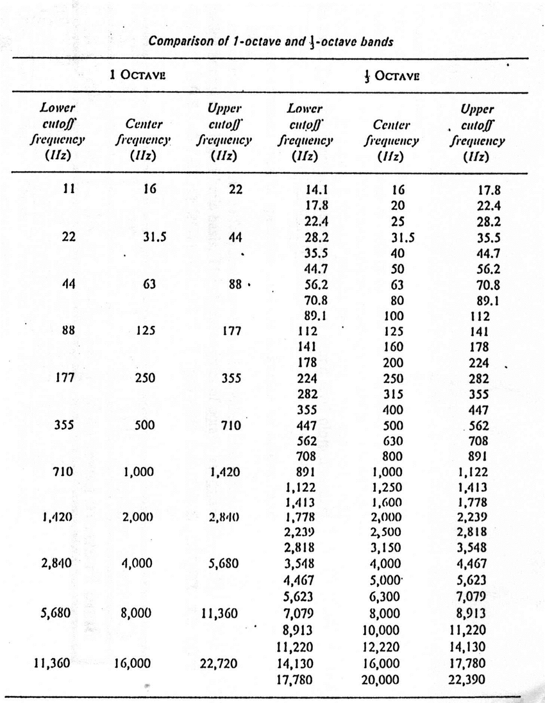

# SoundCard
## library need to install
```cmd
pip install matplotlib
pip install soundcard
```
## signal to octave bands
referenced from <a target="blank" href="https://www.youtube.com/watch?v=4Otqdwql63c">LINK</a>
1. 1024 samples of signal
2. numpy.fft.rfft() to convert into 512 complex elements
3. numpy.abs() to convert into amplitude
4. convert into 10 octave bands
## octave band
Octave-and-one-third-octave-bands.png is from <a target="blank" href="https://www.researchgate.net/figure/Octave-and-one-third-octave-bands_fig1_318659078">LINK</a>

